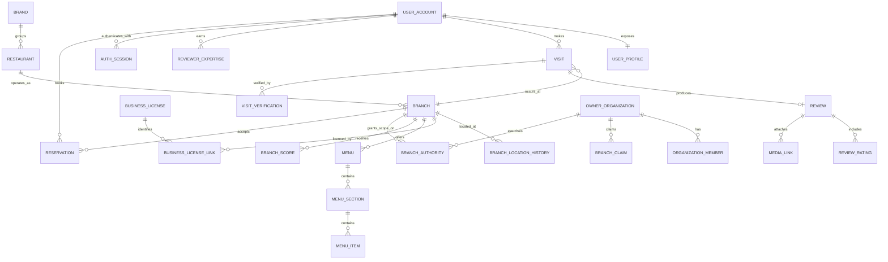

# 도락 데이터 모델 설계

| 항목 | 내용 |
| --- | --- |
| 문서 상태 | Draft |
| 문서 버전 | 0.1.0 |
| 기준 제품 문서 | [PRODUCT.md](../product/PRODUCT.md) |
| 기본 저장소 | PostgreSQL + PostGIS |
| 주요 독자 | 백엔드, 데이터, 검색, 평점, 운영, 개인정보 담당자 |

## 1. 목적

이 문서는 도락의 핵심 데이터 엔터티, 관계, 식별자, 상태, 이력, 출처, 개인정보 경계를 정의한다. 실제 DDL은 이 문서를 기반으로 별도 마이그레이션에서 작성한다.

도락 데이터 모델은 다음 문제를 우선 해결해야 한다.

- 같은 상호를 가진 서로 다른 지점을 구분한다.
- 프랜차이즈 브랜드와 실제 리뷰 대상을 구분한다.
- 음식점의 이전, 폐업, 재개업, 업종 변경을 표현한다.
- 공공데이터, 점주, 사용자 제보가 충돌할 때 출처와 이력을 보존한다.
- 리뷰 원문과 평점 계산용 파생 데이터를 분리한다.
- 방문 인증 원본과 공개 인증 결과를 분리한다.
- 개인정보와 공개 프로필을 물리적 또는 논리적으로 분리한다.
- 데이터 병합과 분리를 되돌릴 수 있게 한다.

## 2. 모델링 원칙

### DM-P01. 리뷰 대상은 실제 지점이다

리뷰, 방문, 예약, 평점은 추상적인 브랜드가 아니라 사용자가 실제로 방문한 `branch`에 연결한다.

### DM-P02. 음식점 정체성과 장소 이력을 분리한다

`restaurant`는 음식점의 독립적인 콘셉트 또는 영업 정체성을 나타내고, `branch`는 공개 페이지와 실제 방문의 대상이다. 주소 변경은 위치 이력으로 관리하며, 정체성이 단절되는 재개업은 새 엔터티로 만든다.

### DM-P03. 현재값과 근거를 함께 관리한다

검색과 화면에 사용하는 현재값은 빠르게 읽을 수 있게 저장하고, 그 값이 어떤 원천과 운영 결정에서 왔는지 별도 출처 테이블에 보존한다.

### DM-P04. 원본, 정규화, 파생 데이터를 분리한다

- 원본: 외부 API 응답, 영수증 이미지, 점주 제출 서류
- 정규화: 음식점, 주소, 메뉴, 리뷰
- 파생: 검색 문서, 공개 점수, 리뷰어 전문성, 위험 신호

파생 데이터는 원본과 정규화 데이터로부터 재생성할 수 있어야 한다.

### DM-P05. 의미 없는 범용 소프트 삭제를 피한다

모든 테이블에 일괄적으로 `deleted_at`을 추가하지 않는다. 도메인별 상태와 법적 보존 요구를 명시하고, 실제 삭제·비공개·폐업·병합을 구분한다.

### DM-P06. 시간은 이력의 일부다

운영 상태, 주소, 영업시간, 메뉴 가격, 점주 권한, 점수는 유효기간을 가질 수 있다. 중요한 변경은 덮어쓰지 않고 이력으로 남긴다.

### DM-P07. 개인정보는 목적별로 격리한다

공개 프로필, 로그인 식별자, 예약 연락처, 방문 인증 증빙을 분리하고 각각 다른 접근 권한과 보존기간을 적용한다.

## 3. 식별자와 공통 규칙

### 3.1 기본 키

- 내부 기본 키는 PostgreSQL `uuid` 타입과 UUIDv7을 사용한다.
- 외부에 노출되는 주요 URL·API 리소스는 prefix와 CSPRNG 기반 최소 128-bit entropy를 가진 별도 공개 ID를 사용한다.
- 내부 UUID는 공개 ID fallback으로 노출하지 않으며, 공개 ID도 권한 검사를 대신하지 않는다.
- 인허가 번호, 사업자등록번호, 지도 사업자 ID를 기본 키로 사용하지 않는다.
- 외부 ID는 공급자 변경, 재발급, 중복 가능성을 고려해 별도 참조로 관리한다.

### 3.2 시간

- 모든 시스템 시각은 UTC `timestamptz`로 저장한다.
- 음식점 영업시간은 지점의 IANA 시간대와 현지 요일을 기준으로 저장한다.
- 사용자가 입력한 방문일은 현지 날짜와 필요 시 정확한 시각을 분리한다.
- 유효기간은 기본적으로 `[valid_from, valid_to)` 반개구간으로 표현한다.

### 3.3 금액

- 원화 금액은 정수로 저장한다.
- 다중 통화를 지원하는 거래 테이블은 `amount_minor`와 ISO 4217 `currency`를 사용한다.
- 표시용 문자열을 원본 금액으로 사용하지 않는다.

### 3.4 위치

- 표준 좌표는 WGS84를 사용한다.
- 검색용 좌표는 PostGIS `geography(Point, 4326)`를 사용한다.
- 공급자가 제공한 원 좌표계와 원본 값은 출처 메타데이터에 보존할 수 있다.
- 주소 문자열과 좌표는 서로 다른 신뢰도와 출처를 가질 수 있다.

### 3.5 텍스트와 번역

- 원문 언어를 BCP 47 언어 태그로 기록한다.
- 사용자 원문을 자동 번역 결과로 덮어쓰지 않는다.
- 검색용 정규화 문자열은 원본 표시 문자열과 분리한다.
- 콘텐츠 언어, UI locale, 지점 지역, 사용자·지점 시간대와 통화를 서로 다른 값으로 관리한다.
- 금액·시각·전화·주소는 locale 중립적인 구조로 저장하고 표시 시점에 현지화한다.

## 4. 상위 도메인 관계

## 5. 음식점 원장 도메인

### 5.1 `brand`

여러 음식점 또는 지점이 공유하는 대외 브랜드다. 독립 음식점은 `brand` 없이 존재할 수 있다.

| 필드 | 설명 |
| --- | --- |
| `id` | 내부 식별자 |
| `canonical_name` | 대표 브랜드명 |
| `normalized_name` | 검색·중복 탐지용 정규화 이름 |
| `brand_type` | `franchise`, `hospitality_group`, `restaurant_group`, `other` |
| `official_website_url` | 공식 웹사이트 |
| `status` | `active`, `inactive`, `merged` |
| `merged_into_brand_id` | 병합 대상 |
| `created_at`, `updated_at` | 생성·수정 시각 |

### 5.2 `restaurant`

음식점의 콘셉트 또는 영업 정체성이다. 동일 브랜드 아래 서로 다른 레스토랑 콘셉트가 있을 수 있다.

| 필드 | 설명 |
| --- | --- |
| `id` | 내부 식별자 |
| `brand_id` | 선택적 브랜드 참조 |
| `canonical_name` | 대표 음식점명 |
| `normalized_name` | 검색·중복 탐지용 이름 |
| `description` | 중립적인 편집 설명 |
| `origin_type` | `independent`, `chain`, `hotel`, `department_store`, `food_hall`, `other` |
| `status` | `active`, `inactive`, `merged` |
| `merged_into_restaurant_id` | 병합 대상 |
| `created_at`, `updated_at` | 생성·수정 시각 |

### 5.3 `branch`

사용자에게 노출되는 실제 지점이며 리뷰, 방문, 예약, 공개 점수의 기본 대상이다.

| 필드 | 설명 |
| --- | --- |
| `id` | 내부 식별자 |
| `public_id` | URL 및 외부 공개용 안정 식별자 |
| `restaurant_id` | 음식점 정체성 참조 |
| `branch_name` | 지점명, 본점 표기 포함 |
| `display_name` | 화면에 표시할 결합 이름 |
| `slug` | 사람이 읽을 수 있는 URL 조각 |
| `primary_category_id` | 대표 장르 |
| `price_band` | 상대 가격대 |
| `timezone` | 지점 시간대 |
| `operational_status` | `pre_open`, `open`, `temporarily_closed`, `closed`, `moved`, `unknown` |
| `status_effective_at` | 현재 영업 상태의 기준 시각 |
| `opened_on` | 알려진 개업일 |
| `closed_on` | 알려진 폐업일 |
| `moved_to_branch_id` | 이전 후 새 페이지 참조 |
| `data_confidence` | 핵심 정보 종합 신뢰도 |
| `last_verified_at` | 핵심 정보 마지막 검증 시각 |
| `created_at`, `updated_at` | 생성·수정 시각 |

#### 지점 상태 규칙

- `temporarily_closed`: 동일 영업 정체성으로 재개 가능성이 있다.
- `closed`: 해당 위치와 정체성의 영업이 종료되었다.
- `moved`: 기존 리뷰를 보존하면서 새 위치 페이지로 연결한다.
- `unknown`: 공공데이터와 사용자 제보가 충돌해 확정할 수 없다.
- 폐업한 지점은 삭제하지 않는다. 기존 리뷰, 리스트, 링크의 역사성을 유지한다.

### 5.4 `branch_location_history`

| 필드 | 설명 |
| --- | --- |
| `id` | 식별자 |
| `branch_id` | 지점 참조 |
| `road_address` | 도로명 주소 |
| `lot_address` | 지번 주소 |
| `address_detail` | 건물·층·호수 |
| `postal_code` | 우편번호 |
| `region_code` | 법정동 또는 행정구역 코드 |
| `point` | 지도 좌표 |
| `entrance_point` | 실제 출입구 좌표, 선택 |
| `floor_label` | 층 정보 |
| `valid_from`, `valid_to` | 유효기간 |
| `source_assertion_id` | 채택 근거 |
| `created_at` | 생성 시각 |

한 시점에 하나의 지점에는 하나의 주 위치만 유효해야 한다. 이전이 불명확한 경우 기존 행을 닫기 전에 운영 검수를 거친다.

### 5.5 `branch_relation`

지점 사이의 의미 있는 관계를 표현한다.

| 필드 | 설명 |
| --- | --- |
| `from_branch_id` | 출발 지점 |
| `to_branch_id` | 대상 지점 |
| `relation_type` | `moved_to`, `reopened_as`, `split_from`, `replaced_by`, `same_complex` |
| `effective_at` | 관계 발생 시각 |
| `note` | 운영 메모 |

### 5.6 `business_license`

공공 인허가 원장의 정규화 레코드다. 대표자명처럼 공개 서비스에 불필요한 개인정보는 수집·노출 범위를 별도로 제한한다.

| 필드 | 설명 |
| --- | --- |
| `id` | 내부 식별자 |
| `licensing_authority` | 허가기관 |
| `license_number_ciphertext` | 필요 시 암호화한 인허가 번호 |
| `license_number_hash` | 일치 확인용 해시 |
| `business_type_code` | 공공 업종 코드 |
| `permit_date` | 인허가일 |
| `closure_date` | 폐업일 |
| `license_status` | 정규화 상태 |
| `raw_source_record_id` | 최신 원본 참조 |
| `created_at`, `updated_at` | 생성·수정 시각 |

### 5.7 `business_license_link`

| 필드 | 설명 |
| --- | --- |
| `branch_id` | 지점 참조 |
| `business_license_id` | 인허가 참조 |
| `valid_from`, `valid_to` | 연결 유효기간 |
| `match_method` | `exact`, `probabilistic`, `manual` |
| `match_confidence` | 자동 매칭 신뢰도 |
| `approved_by` | 수동 승인 운영자, 선택 |

하나의 인허가 레코드가 무조건 하나의 공개 음식점 페이지와 일치한다고 가정하지 않는다. 푸드코트, 복합매장, 공유주방 등 예외를 허용한다.

### 5.8 카테고리

#### `category`

| 필드 | 설명 |
| --- | --- |
| `id` | 식별자 |
| `parent_id` | 상위 카테고리 |
| `code` | 안정적인 내부 코드 |
| `name_ko` | 한국어 표시명 |
| `category_type` | `cuisine`, `dish`, `venue`, `dietary`, `occasion` |
| `is_score_domain` | 리뷰어 전문성 및 점수 도메인 여부 |
| `status` | 활성 상태 |

#### `branch_category`

| 필드 | 설명 |
| --- | --- |
| `branch_id` | 지점 |
| `category_id` | 카테고리 |
| `role` | `primary`, `secondary`, `inferred` |
| `confidence` | 분류 신뢰도 |
| `source_assertion_id` | 근거 |

카테고리는 트리만으로 모든 의미를 표현하려 하지 않는다. 라멘처럼 장르이자 대표 메뉴인 항목은 필요하면 복수 분류 축을 사용한다.

## 6. 정보 출처와 변경 이력

### 6.1 `data_source`

| 필드 | 설명 |
| --- | --- |
| `id` | 식별자 |
| `source_type` | `public_api`, `owner`, `user`, `operator`, `partner`, `derived` |
| `name` | 출처명 |
| `license_policy` | 활용 조건 참조 |
| `retention_policy` | 원본 보관 정책 |
| `trust_tier` | 기본 신뢰 등급 |

출처의 허용 용도, 공개 귀속, 저장·재배포, 계약 종료 후 삭제 조건은 [DATA_INGESTION.md](./DATA_INGESTION.md)의 출처 등록부를 기준으로 확장한다.

### 6.2 `source_snapshot`

특정 출처를 특정 시점과 범위에서 수집한 실행 단위다.

| 필드 | 설명 |
| --- | --- |
| `id` | 스냅샷 식별자 |
| `data_source_id` | 출처 |
| `fetch_mode` | 전체, 증분, 웹훅 묶음, 파일 업로드 |
| `source_as_of` | 원천 기준 시각 |
| `request_parameters_hash` | 수집 범위 재현용 해시 |
| `record_count`, `content_checksum` | 완전성 검산 |
| `schema_fingerprint` | 원천 스키마 drift 탐지 |
| `status` | 수집·검증·처리 상태 |
| `started_at`, `completed_at` | 실행 시각 |

### 6.3 `raw_source_record`

외부 데이터의 원본 스냅샷 또는 변경분을 저장한다.

| 필드 | 설명 |
| --- | --- |
| `id` | 식별자 |
| `data_source_id` | 출처 |
| `source_snapshot_id` | 수집 스냅샷 |
| `external_record_key` | 출처 내부 키 |
| `payload_uri` 또는 `payload_json` | 원본 위치 또는 내용 |
| `payload_hash` | 중복 및 무결성 확인 |
| `observed_at` | 원천에서 관찰한 시각 |
| `ingested_at` | 도락 수집 시각 |
| `processing_status` | 처리 상태 |
| `schema_version` | 원본 파서 버전 |

원본 이용조건상 영구 저장이 허용되지 않으면 필요한 파생값만 저장하고 원본은 만료시킨다.

### 6.4 `data_assertion`

특정 엔터티의 특정 필드에 대해 한 출처가 주장하는 후보값이다.

| 필드 | 설명 |
| --- | --- |
| `id` | 식별자 |
| `entity_type`, `entity_id` | 대상 |
| `field_path` | 대상 필드 |
| `value_json` | 후보값 |
| `data_source_id` | 출처 |
| `raw_source_record_id` | 원본 참조 |
| `asserted_by_actor_id` | 점주·사용자·운영자, 선택 |
| `asserted_at`, `observed_at` | 제출 시각과 사실을 관측한 시각 |
| `valid_from`, `valid_to` | 주장 유효기간 |
| `confidence` | 출처 및 검증 기반 신뢰도 |
| `status` | `pending`, `accepted`, `rejected`, `superseded`, `expired`, `withdrawn` |
| `decision_rule_version` | 자동·수동 선택 규칙 버전 |
| `decision_reason_code` | 채택·거절·대체 사유 |

### 6.5 `entity_change`

| 필드 | 설명 |
| --- | --- |
| `id` | 변경 식별자 |
| `entity_type`, `entity_id` | 변경 대상 |
| `field_path` | 변경 필드 |
| `old_value_json`, `new_value_json` | 이전·신규 값 |
| `selected_assertion_id` | 채택 근거 |
| `change_reason_code` | 표준 사유 |
| `actor_type`, `actor_id` | 변경 주체 |
| `occurred_at` | 변경 시각 |
| `reversal_of_change_id` | 되돌리기 관계 |

## 7. 영업시간과 상태

### 7.1 `business_hours_rule`

| 필드 | 설명 |
| --- | --- |
| `id` | 식별자 |
| `branch_id` | 지점 |
| `day_of_week` | 현지 요일 |
| `service_type` | `regular`, `break`, `last_order`, `takeout`, `reservation` |
| `opens_at`, `closes_at` | 현지 시각 |
| `crosses_midnight` | 익일 종료 여부 |
| `valid_from`, `valid_to` | 시즌별 유효기간 |
| `source_assertion_id` | 근거 |

하루에 여러 영업 구간을 허용한다. `24:00` 같은 비표준 시각을 저장하지 않고 익일 여부로 표현한다.

### 7.2 `business_hours_exception`

| 필드 | 설명 |
| --- | --- |
| `id` | 식별자 |
| `branch_id` | 지점 |
| `local_date` | 예외 날짜 |
| `exception_type` | `closed`, `special_hours`, `sold_out`, `private_event` |
| `opens_at`, `closes_at` | 특별 영업시간 |
| `expires_at` | 공지 만료 시각 |
| `source_assertion_id` | 근거 |

## 8. 메뉴 도메인

### 8.1 `menu`

| 필드 | 설명 |
| --- | --- |
| `id` | 식별자 |
| `branch_id` | 지점 |
| `name` | 메뉴판 이름 |
| `service_period` | `all_day`, `breakfast`, `lunch`, `dinner`, `late_night`, `other` |
| `valid_from`, `valid_to` | 유효기간 |
| `status` | `draft`, `published`, `archived` |
| `source_type` | 점주, 사용자, 운영자, 파트너 |

### 8.2 `menu_section`

| 필드 | 설명 |
| --- | --- |
| `id` | 식별자 |
| `menu_id` | 메뉴판 |
| `name` | 섹션명 |
| `description` | 설명 |
| `sort_order` | 정렬 순서 |

### 8.3 `menu_item`

| 필드 | 설명 |
| --- | --- |
| `id` | 식별자 |
| `menu_section_id` | 섹션 |
| `canonical_dish_id` | 표준 음식 분류, 선택 |
| `name` | 메뉴명 |
| `description` | 설명 |
| `base_price_minor`, `currency` | 기본 가격 |
| `availability_status` | `available`, `sold_out`, `seasonal`, `discontinued` |
| `dietary_flags` | 채식 등 구조화 속성 |
| `allergen_statement` | 점주 제공 알레르기 문구 |
| `sort_order` | 정렬 순서 |

### 8.4 `menu_item_price_history`

가격을 덮어쓰지 않고 변경 이력으로 관리한다.

| 필드 | 설명 |
| --- | --- |
| `menu_item_id` | 메뉴 항목 |
| `amount_minor`, `currency` | 가격 |
| `valid_from`, `valid_to` | 유효기간 |
| `source_assertion_id` | 근거 |

### 8.5 `menu_item_option_group`, `menu_item_option`

사이즈, 맵기, 토핑, 코스 선택을 구조화한다. 예약 코스와 일반 메뉴는 공통 메뉴 항목을 참조할 수 있지만 재고 및 예약 정책은 별도 도메인에서 관리한다.

## 9. 미디어 도메인

### 9.1 `media_asset`

| 필드 | 설명 |
| --- | --- |
| `id` | 식별자 |
| `media_class`, `purpose` | 공개 사용자·점주·editorial·증빙 분류와 사용 목적 |
| `owner_actor_type`, `owner_actor_id` | 업로드 주체 |
| `source_type`, `source_reference` | 업로드·외부 원천·운영 생성 등 출처 |
| `detected_mime` | 실제 디코딩으로 확인한 MIME 유형 |
| `width`, `height`, `duration_ms`, `byte_size` | 미디어 속성 |
| `content_hash`, `perceptual_hash` | 중복·조작 탐지 |
| `metadata_status`, `security_status` | 메타데이터 제거와 보안 검사 상태 |
| `processing_status` | `created`부터 `ready`, `rejected`, `quarantined`, `processing_failed`, `expired`까지의 처리 상태 |
| `moderation_status` | 검수 상태 |
| `publication_status` | `unpublished`, `pending_parent_publish`, `published`, `limited`, `hidden`, `removed`, `deleted` |
| `rights_status`, `retention_class` | 권리와 목적별 보존 정책 |
| `created_at`, `ready_at`, `published_at`, `deleted_at` | 생명주기 시각 |
| `version` | 낙관적 동시성 버전 |

EXIF 원본은 공개하지 않는다. 위치와 촬영시각 같은 메타데이터는 방문 인증 파생 결과를 만든 뒤 보존정책에 따라 제거한다.

### 9.2 `media_object`, `media_variant`

실제 객체 저장과 논리 asset을 분리한다. 원본 격리본·정규화 master·공개 variant·비공개 증빙은 서로 다른 객체와 접근 등급을 가진다.

| 필드 | 설명 |
| --- | --- |
| `id`, `asset_id` | 객체와 논리 asset 식별자 |
| `object_role` | `original_quarantine`, `master`, `variant`, `evidence` |
| `bucket_ref`, `object_key` | 저장소 참조; domain foreign key로 사용하지 않음 |
| `storage_class`, `encryption_key_ref` | 저장·암호화 등급 |
| `content_hash`, `mime`, `width`, `height`, `byte_size` | 검증된 객체 속성 |
| `variant_code`, `transformation_recipe_version` | 파생본 규격과 재생성 버전 |
| `created_at`, `expires_at`, `deleted_at` | 객체 생명주기 |

### 9.3 `media_link`

| 필드 | 설명 |
| --- | --- |
| `asset_id` | 미디어 |
| `target_type`, `target_id` | 리뷰 revision, 지점, 메뉴 등 대상 |
| `role` | `review`, `official`, `menu`, `exterior`, `interior`, `receipt_evidence` |
| `sort_order` | 노출 순서 |
| `caption`, `alt_text` | 설명과 대체 텍스트 |
| `link_status`, `linked_by` | 연결 상태와 행위자 |
| `valid_from`, `valid_to` | 연결 이력 |

비공개 증빙은 공개 콘텐츠의 `media_link`로 연결하지 않고 제한 접근 evidence 참조를 사용한다.

### 9.4 처리·권리·검수 레코드

- `media_processing_job`: 단계, processor version, 시도, 안전한 오류 코드와 실행 시각
- `media_rights_record`: 권리 근거, 업로더 확인 버전, license scope, credit, 분쟁·철회 상태
- `media_moderation_result`: 자동 signal과 사람 결정을 분리한 검수 결과

상세 상태 머신과 객체 접근 경계는 [MEDIA_PIPELINE.md](../features/MEDIA_PIPELINE.md)를 단일 기준으로 삼는다.

## 10. 사용자와 인증 도메인

### 10.1 `user_account`

| 필드 | 설명 |
| --- | --- |
| `id` | 내부 사용자 식별자 |
| `account_status` | `pending`, `active`, `restricted`, `suspended`, `closed` |
| `trust_state` | 내부 신뢰 상태 |
| `locale` | 기본 언어 |
| `timezone` | 기본 시간대 |
| `created_at`, `closed_at` | 생명주기 시각 |

`user_account`에는 이메일, 전화번호, 실명 같은 직접 식별정보를 넣지 않는다.

### 10.2 `user_identity` — 제한 접근 영역

| 필드 | 설명 |
| --- | --- |
| `id` | 식별자 |
| `user_account_id` | 사용자 |
| `provider` | `apple`, `google`, `kakao`, `email`, `phone` |
| `provider_subject_ciphertext` | 공급자 식별자 |
| `provider_subject_hash` | 중복 연결 확인 |
| `email_ciphertext`, `phone_ciphertext` | 필요한 경우 암호화 저장 |
| `verified_at` | 인증 시각 |
| `created_at`, `revoked_at` | 연결 생명주기 |

이메일 일치만으로 서로 다른 공급자의 identity나 계정을 자동 연결하지 않는다. 활성 `(provider, provider_subject_hash)`와 passkey credential은 각각 고유해야 한다.

### 10.3 `auth_session`

| 필드 | 설명 |
| --- | --- |
| `id`, `user_account_id` | 세션과 사용자 |
| `session_family_id` | refresh rotation·재사용 탐지 단위 |
| `client_type`, `device_reference` | 클라이언트와 최소화한 기기 참조 |
| `created_at`, `last_seen_at` | 생성·최근 사용 시각 |
| `absolute_expires_at`, `idle_expires_at` | 절대·유휴 만료 |
| `auth_time`, `assurance_level` | 실제 인증 시각과 보증 수준 |
| `risk_state` | 세션 위험 상태 |
| `revoked_at`, `revoke_reason` | 해제 결과 |

### 10.4 `refresh_credential` — 제한 접근 영역

| 필드 | 설명 |
| --- | --- |
| `session_id` | 소속 세션 |
| `token_hash` | 원문이 아닌 refresh token 해시 |
| `rotation_counter` | 회전 순서 |
| `issued_at`, `expires_at`, `consumed_at` | 생명주기 |
| `replaced_by_hash`, `reuse_detected_at` | 교체와 재사용 탐지 |

### 10.5 `authentication_event`, `recovery_case`

인증 사건은 결과·위험 분류·request ID를 기록하되 비밀번호, OTP, token, 전체 IP를 일반 분석으로 보내지 않는다. 고위험 복구는 `recovery_case`로 모델링해 위험 등급, 최소 증빙 참조, cooling, 검토·승인과 결정을 감사 가능하게 남긴다.

세션, identity 연결, passkey·MFA와 복구의 상세 규칙은 [AUTH_IDENTITY.md](./AUTH_IDENTITY.md)를 따른다.

### 10.6 `user_profile`

| 필드 | 설명 |
| --- | --- |
| `user_account_id` | 사용자 |
| `handle` | 고유 공개 핸들 |
| `display_name` | 공개 이름 |
| `bio` | 소개 |
| `avatar_media_id` | 프로필 이미지 |
| `profile_visibility` | 공개 범위 |
| `follower_count`, `following_count` | 캐시된 집계 |
| `review_count` | 캐시된 공개 리뷰 수 |

### 10.7 `user_preference`

알림, 개인정보, 추천, 차단 기본값을 저장한다. 법적 동의 이력은 현재 설정과 분리한다.

### 10.8 `consent_record`

| 필드 | 설명 |
| --- | --- |
| `id` | 식별자 |
| `user_account_id` | 사용자 |
| `consent_type` | 약관, 개인정보, 위치, 마케팅 등 |
| `document_version` | 동의 문서 버전 |
| `decision` | 동의 또는 철회 |
| `decided_at` | 결정 시각 |
| `evidence` | 채널 및 화면 버전 등 최소 증빙 |

현재 동의 여부만 덮어쓰지 않고 의사결정 이력을 보존한다.

## 11. 방문과 리뷰 도메인

### 11.1 `visit`

한 사용자의 한 지점 방문 경험을 나타낸다. 리뷰 없이 방문 기록만 존재할 수 있다.

| 필드 | 설명 |
| --- | --- |
| `id` | 방문 식별자 |
| `user_account_id` | 방문 사용자 |
| `branch_id` | 방문 지점 |
| `visited_local_date` | 현지 방문일 |
| `visited_at` | 정확한 방문시각, 선택 |
| `time_slot` | `breakfast`, `lunch`, `dinner`, `late_night`, `unknown` |
| `party_size` | 인원, 선택 |
| `occasion` | 혼밥, 데이트, 가족 등 |
| `spend_minor`, `currency` | 사용자 입력 지출액, 선택 |
| `reservation_id` | 관련 예약, 선택 |
| `verification_level` | 계산된 방문 인증 등급 |
| `created_at`, `updated_at` | 생성·수정 시각 |

동일 사용자가 같은 지점을 같은 날짜와 유사한 시간에 중복 기록하면 병합 후보로 분류한다.

### 11.2 `visit_order_item`

| 필드 | 설명 |
| --- | --- |
| `visit_id` | 방문 |
| `menu_item_id` | 구조화 메뉴 참조, 선택 |
| `entered_name` | 사용자가 입력한 당시 메뉴명 |
| `quantity` | 수량 |
| `amount_minor`, `currency` | 당시 가격, 선택 |

메뉴가 이후 삭제되거나 이름이 변경되어도 당시 입력 문자열을 보존한다.

### 11.3 `visit_verification`

| 필드 | 설명 |
| --- | --- |
| `id` | 인증 식별자 |
| `visit_id` | 방문 |
| `method` | `reservation`, `receipt`, `merchant_qr`, `payment`, `location`, `manual` |
| `status` | `pending`, `verified`, `rejected`, `revoked`, `expired` |
| `confidence` | 방법별 정규화 신뢰도 |
| `verified_at` | 인증 시각 |
| `evidence_id` | 제한 접근 증빙 참조, 선택 |
| `processor_version` | 검증 로직 버전 |
| `rejection_reason_code` | 실패 사유 |

여러 인증 수단을 결합해 `visit.verification_level`을 계산한다. 하나의 수단 실패로 다른 수단의 결과를 덮어쓰지 않는다.

### 11.4 `verification_evidence` — 고도 제한 접근 영역

영수증 원본, 위치 샘플, 결제 토큰 등 인증 원본의 메타데이터를 저장한다.

| 필드 | 설명 |
| --- | --- |
| `id` | 식별자 |
| `evidence_type` | 증빙 유형 |
| `encrypted_storage_key` | 암호화 원본 위치 |
| `derived_fingerprint` | 중복 사용 탐지용 파생값 |
| `retention_expires_at` | 파기 예정 시각 |
| `destroyed_at` | 실제 파기 시각 |
| `access_class` | 접근 등급 |

### 11.5 `review`

| 필드 | 설명 |
| --- | --- |
| `id` | 리뷰 식별자 |
| `visit_id` | 방문 참조, 고유 |
| `user_account_id` | 비정규화 작성자 참조 |
| `branch_id` | 비정규화 지점 참조 |
| `title` | 선택적 제목 |
| `body` | 원문 |
| `language` | 원문 언어 |
| `overall_rating` | 사용자가 입력한 원점수 |
| `revisit_intent` | 재방문 의사 |
| `disclosure_state` | 이해관계 공개 상태 |
| `publication_status` | `draft`, `pending`, `published`, `limited`, `hidden`, `removed` |
| `score_eligibility` | `pending`, `eligible`, `ineligible`, `excluded_integrity`, `excluded_policy`, `revoked` |
| `score_exclusion_reason` | 제외 사유 코드 |
| `published_at`, `updated_at` | 게시·수정 시각 |
| `content_version` | 콘텐츠 버전 |

리뷰 공개 상태와 점수 포함 상태를 분리한다. 정책상 공개 가능하지만 평점 계산에서는 제외되는 리뷰가 존재할 수 있다.

### 11.6 `review_revision`

| 필드 | 설명 |
| --- | --- |
| `id` | 버전 식별자 |
| `review_id` | 리뷰 |
| `revision_number` | 증가 버전 |
| `body`, `overall_rating`, `revisit_intent` | 당시 내용 |
| `edit_reason` | 사용자 선택 또는 운영 사유 |
| `created_at` | 수정 시각 |

### 11.7 `review_rating`

세부 평가를 확장 가능한 형태로 저장한다.

| 필드 | 설명 |
| --- | --- |
| `review_id` | 리뷰 |
| `dimension_code` | `food`, `service`, `ambience`, `value` 또는 장르별 차원 |
| `raw_value` | 사용자 입력 값 |
| `scale_version` | 평가 척도 버전 |

종합 점수와 장르별 차원의 관계는 `RATING_SYSTEM.md`에서 정의한다.

### 11.8 `review_disclosure`

| 필드 | 설명 |
| --- | --- |
| `review_id` | 리뷰 |
| `disclosure_type` | `self_paid`, `discounted`, `invited`, `sponsored`, `employee`, `owner_relation`, `other` |
| `details` | 필요한 설명 |
| `declared_at` | 공개 시각 |

### 11.9 `review_reaction`, `review_comment`

도움됨 반응은 계정당 리뷰당 하나로 제한한다. 댓글 기능을 도입할 경우 리뷰와 독립된 모더레이션 상태와 차단 규칙을 적용한다.

## 12. 평점과 전문성 파생 데이터

이 영역의 값은 계산 버전과 입력 스냅샷을 가져야 한다. 상세 공식은 `RATING_SYSTEM.md`에서 정의한다.

### 12.1 `rating_model_version`

| 필드 | 설명 |
| --- | --- |
| `id` | 모델 버전 |
| `semantic_version` | 사람이 읽는 버전 |
| `config_hash` | 설정 무결성 |
| `status` | `draft`, `shadow`, `active`, `retired` |
| `effective_from` | 공개 적용 시각 |
| `input_cutoff_at` | 입력 데이터 기준 시각 |
| `created_by`, `approved_by` | 작성·승인 주체 |

### 12.2 `branch_score`

| 필드 | 설명 |
| --- | --- |
| `branch_id` | 지점 |
| `rating_model_version_id` | 모델 버전 |
| `category_id` | 전체 또는 장르별 점수 |
| `public_score` | 공개 점수 |
| `internal_score` | 내부 연속 점수 |
| `confidence_lower`, `confidence_upper` | 신뢰 구간 |
| `eligible_review_count` | 포함 리뷰 수 |
| `verified_review_ratio` | 인증 리뷰 비율 |
| `calculated_at` | 계산 시각 |
| `published_at` | 공개 시각 |
| `input_snapshot_id` | 입력 스냅샷 |

활성 모델 버전과 지점·카테고리 조합당 하나의 공개 점수만 존재한다.

### 12.3 `review_score_contribution`

| 필드 | 설명 |
| --- | --- |
| `review_id` | 리뷰 |
| `branch_score_id` | 결과 점수 |
| `normalized_rating` | 리뷰어 기준 보정값 |
| `effective_weight` | 최종 영향 가중치 |
| `eligibility_state` | 포함 여부 |
| `reason_codes` | 영향 요인 코드, 내부 전용 |

정확한 조작 방지 파라미터는 외부 API와 사용자 화면에 노출하지 않는다.

### 12.4 `reviewer_expertise`

| 필드 | 설명 |
| --- | --- |
| `user_account_id` | 리뷰어 |
| `category_id` | 전문 장르 |
| `region_code` | 선택적 지역 전문성 |
| `model_version_id` | 계산 버전 |
| `expertise_score` | 내부 전문성 |
| `public_tier` | 공개 등급, 최소 조건 충족 시 |
| `eligible_review_count` | 유효 리뷰 수 |
| `calculated_at` | 계산 시각 |

### 12.5 `rating_snapshot`

어워드, 랭킹, 감사, 재현을 위한 입력 및 결과 스냅샷이다. 스냅샷에는 원문 개인정보를 복제하지 않고 참조 ID와 해시를 우선 사용한다.

### 12.6 편집·어워드

어워드는 live 점수에 붙인 boolean이 아니라 program·snapshot·심사·공개의 독립 생명주기다.

| 엔터티 | 설명 |
| --- | --- |
| `editorial_program` | 유형, 연도·기간, 범위, 방법 version, cutoff·발표·archive 상태 |
| `editorial_eligibility_policy` | 지역·장르·운영기간·evidence·integrity 기준 version |
| `award_candidate` | branch, 후보 source, snapshot, eligibility·hold·review 상태 |
| `editorial_evaluation` | rubric version, 관찰·confidence·evidence와 평가자 token |
| `editorial_conflict_record` | 후보·조직과 평가자의 이해충돌, 제척·해결 이력 |
| `award_decision` | 선정·tier·reason·panel quorum·조건·승인 version |
| `award_publication` | locale별 공개 내용과 `draft`, `approved`, `embargoed`, `published`, `corrected`, `suspended`, `withdrawn`, `archived` 상태 |
| `award_mark_license` | 선정 지점·조직, asset version, 허용 매체·기간·상태 |
| `editorial_correction`, `award_appeal` | 원 결정을 덮어쓰지 않는 정정·이의·재심 이력 |

광고·구독·예약 계약 값은 후보와 decision 입력이 될 수 없다. 상세 governance는 [EDITORIAL_AWARDS.md](../features/EDITORIAL_AWARDS.md)를 따른다.

## 13. 저장, 리스트, 팔로우

### 13.1 `saved_branch`

| 필드 | 설명 |
| --- | --- |
| `user_account_id` | 사용자 |
| `branch_id` | 지점 |
| `save_state` | `want_to_go`, `visited`, `favorite` |
| `private_note` | 개인 메모 |
| `created_at`, `updated_at` | 시각 |

### 13.2 `user_list`, `user_list_item`

`user_list`는 공개 범위, 제목, 설명, 대표 이미지, 정렬 방식을 가진다. `user_list_item`은 지점, 작성자 설명, 순서, 추가 시각을 가진다. 리스트 공개 설명과 개인 메모를 분리한다.

### 13.3 `user_follow`

팔로우 요청형 계정을 지원할 수 있도록 `pending`, `accepted`, `rejected` 상태를 가진다.

### 13.4 `user_block`

차단 관계는 대칭이 아니다. 차단한 사용자의 콘텐츠 노출, 댓글, 팔로우, 알림 생성 시 공통 정책 서비스가 참조한다.

## 14. 점주와 조직 도메인

### 14.1 `owner_organization`

| 필드 | 설명 |
| --- | --- |
| `id` | 조직 식별자 |
| `organization_type` | `independent_owner`, `restaurant_group`, `franchise_headquarters`, `franchisee`, `agency`, `management_company` |
| `legal_name_ciphertext` | 필요 시 제한 접근 법적 명칭 |
| `display_name` | 표시명 |
| `status` | 인증 상태 |
| `created_at` | 생성 시각 |

### 14.2 `organization_relation`

프랜차이즈 본사, 가맹점, 운영회사, 대행사의 관계를 표현한다. 관계 자체가 지점 데이터 전체 접근권을 부여하지 않는다.

| 필드 | 설명 |
| --- | --- |
| `parent_organization_id`, `child_organization_id` | 관계 조직 |
| `relationship_type` | 프랜차이즈, 운영 위임, 대행 등 |
| `authority_scope` | 허용 가능한 권한 범위 |
| `verification_status` | 관계 검증 상태 |
| `valid_from`, `valid_to` | 효력 기간 |

### 14.3 `organization_member`

| 필드 | 설명 |
| --- | --- |
| `organization_id` | 조직 |
| `user_account_id` | 구성원 |
| `role` | `owner`, `admin`, `editor`, `reservation_manager`, `analyst`, `billing`, `review_manager` |
| `branch_scope` | 접근 가능한 지점 범위 |
| `status` | 초대·활성·해제 상태 |
| `valid_from`, `valid_to` | 권한 기간 |

### 14.4 `branch_claim`

| 필드 | 설명 |
| --- | --- |
| `id` | 신청 식별자 |
| `organization_id` | 신청 조직 |
| `branch_id` | 대상 지점 |
| `claim_method` | 인증 방식 |
| `status` | 공개 요약: `draft`, `pending`, `approved`, `rejected`, `revoked`, `disputed`, `withdrawn` |
| `workflow_step` | 신원·권한 확인, 충돌 검토, 증빙 대기 등 내부 처리 단계 |
| `evidence_id` | 제한 접근 증빙 |
| `reviewed_by` | 검토 운영자 |
| `decision_reason` | 결정 사유 |
| `valid_from`, `valid_to` | 관리 권한 기간 |

한 지점에 복수 조직이 서로 다른 역할로 접근할 수 있지만 공식 소유권 충돌은 분쟁 상태로 처리한다.

### 14.5 `branch_authority`

승인된 조직이 특정 지점에서 실제로 행사할 수 있는 권한 관계다. claim 신청·결정과 현재 권한을 분리한다.

| 필드 | 설명 |
| --- | --- |
| `organization_id`, `branch_id` | 조직과 지점 |
| `authority_type` | 소유, 운영, 브랜드, 대행 등 |
| `permission_scope` | 허용 권한의 상한 |
| `source_claim_id` | 권한의 근거 claim |
| `status` | 활성, 정지, 분쟁, 종료 |
| `valid_from`, `valid_to` | 효력 기간 |

### 14.6 `owner_response`

점주 공식 답변은 리뷰와 조직, 실제 작성 구성원을 모두 참조한다. 공개 작성자는 조직으로 표시하되 내부 감사에는 구성원을 남긴다.

## 15. 예약과 상거래 도메인 경계

### 15.1 예약

예약 상세 모델은 `RESERVATION_SYSTEM.md`에서 정의한다. 핵심 관계는 다음과 같다.

- `bookable_resource`: 테이블, 룸, 카운터 좌석, 좌석 조합
- `resource_combination`: 점주가 허용한 좌석 조합
- `booking_policy`: 지점 예약 기본 정책과 버전
- `service_period`: 점심·저녁 등 예약 운영 구간
- `availability_rule`: 정기 예약 가능 규칙
- `availability_exception`: 특정 날짜 예외
- `reservation_slot`: 판매 가능한 시간·인원 재고
- `reservation_hold`: 결제·입력 중 짧은 재고 점유
- `reservation`: 사용자 예약 주문
- `reservation_party`: 예약자 연락처와 인원
- `reservation_allocation`: 예약과 실제 자원·점유 시간 관계
- `reservation_status_history`: 상태 변경 이력
- `reservation_change_proposal`: 시간·인원·코스·금액 변경 제안
- `payment_intent`: 예약금 및 선결제 시도
- `payment_attempt`, `charge`: 공급자 시도와 금전 이동
- `refund`: 환불
- `cancellation_policy_version`: 예약 당시 고정된 취소 정책 버전
- `waitlist_entry`: 웨이팅 신청

예약 연락처와 동행자 정보는 공개 사용자 프로필과 분리한다. 리뷰 방문 인증에는 예약 완료와 실제 착석 또는 점주 완료 신호를 구분해 전달한다.

### 15.2 광고·구독·청구

수익화 데이터는 공개 점수·리뷰·자연 검색 원장과 분리한다.

| 묶음 | 핵심 엔터티 |
| --- | --- |
| 광고주·캠페인 | `advertiser_account`, `ad_campaign`, `ad_campaign_revision`, `ad_group`, `ad_target_rule`, `ad_creative_revision`, `ad_policy_review` |
| delivery | `ad_budget`, `ad_spend_reservation`, `ad_opportunity`, `ad_decision`, `ad_impression`, `ad_click`, `ad_conversion` |
| 무결성·귀속 | `ad_invalid_traffic_decision`, `ad_attribution` |
| 계약·구독 | `commercial_contract`, `product_plan_version`, `price_version`, `subscription`, `entitlement_grant` |
| 청구·결제 | `billing_account`, `usage_record`, `invoice`, `invoice_line`, `payment_attempt`, `payment_transaction`, `credit_note`, `refund` |
| 분쟁·대조 | `billing_dispute`, `billing_reconciliation_case` |

공통 규칙:

- campaign·creative·price·contract는 효력 version을 가진다.
- billable event와 invoice line은 idempotent하게 일대일 또는 명시된 집계 관계를 가진다.
- 금액 정정은 원장을 덮어쓰지 않고 credit·refund·reversal로 표현한다.
- subscription entitlement와 조직 claim·기본 정보 수정 권한을 합치지 않는다.
- `sponsored`와 `organic` placement를 모든 응답·이벤트·집계에서 구분한다.
- 광고비와 구독 등급은 `branch_score`, review eligibility, organic ranking의 입력이 될 수 없다.

상세 상태·과금·광고 표시 기준은 [ADVERTISING_MONETIZATION.md](../features/ADVERTISING_MONETIZATION.md)를 따른다.

## 16. 신고, 모더레이션, 분쟁

### 16.1 `report`

| 필드 | 설명 |
| --- | --- |
| `id` | 신고 식별자 |
| `reporter_actor_type`, `reporter_actor_id` | 신고자 |
| `target_type`, `target_id` | 대상 |
| `reason_code` | 표준 신고 사유 |
| `description` | 추가 설명 |
| `evidence_ids` | 비공개 증빙 참조 |
| `status` | 접수·검토·완료 상태 |
| `created_at` | 접수 시각 |

### 16.2 `moderation_case`

여러 신고와 자동 위험 신호를 하나의 사건으로 묶는다.

| 필드 | 설명 |
| --- | --- |
| `id` | 사건 식별자 |
| `case_type` | 리뷰, 계정, 사진, 점주, 법적 요청 등 |
| `priority` | 우선순위 |
| `status` | `open`, `investigating`, `awaiting_response`, `decided`, `appealed`, `closed` |
| `assignee_id` | 담당 운영자 |
| `policy_version` | 적용 정책 버전 |
| `legal_hold` | 법적 보존 여부 |
| `opened_at`, `closed_at` | 처리 시각 |

### 16.3 `moderation_decision`

| 필드 | 설명 |
| --- | --- |
| `case_id` | 사건 |
| `decision_type` | 유지, 제한, 블라인드, 삭제, 경고, 정지 등 |
| `reason_code` | 표준 사유 |
| `target_type`, `target_id` | 조치 대상 |
| `effective_from`, `effective_to` | 조치 기간 |
| `decided_by`, `approved_by` | 결정·승인 운영자 |
| `reversal_of_decision_id` | 되돌리기 관계 |

### 16.4 `appeal`

원결정과 이의 제기 내용, 제출 증빙, 재검토자, 결과를 연결한다. 이의 제기 과정에서 제출된 민감정보는 공개 콘텐츠와 분리한다.

### 16.5 `operations_case`

데이터 정정, 점주 claim, 예약·결제, 개인정보, 보안처럼 콘텐츠 모더레이션 밖의 운영 사건을 공통 처리한다. `moderation_case`는 정책 판단에 특화된 사건이며 필요하면 상위 `operations_case`와 연결한다.

| 필드 | 설명 |
| --- | --- |
| `id`, `case_type` | 사건 식별자와 유형 |
| `subject_type`, `subject_id` | 주 대상 |
| `priority`, `status` | 우선순위와 공통 workflow 상태 |
| `assigned_team`, `assigned_operator_id` | 책임 팀·담당자 |
| `sensitivity_class` | 개인정보·결제·법적 접근 등급 |
| `next_action`, `due_at` | 다음 행동과 기한 |
| `related_case_ids` | 모더레이션·장애·분쟁 연결 |
| `created_at`, `resolved_at`, `closed_at` | 처리 시각 |

## 17. 검색과 읽기 모델

검색 엔진 문서는 원장 데이터의 복제된 읽기 모델이다.

### 17.1 `branch_search_document`

개념적으로 다음 필드를 포함한다.

- 지점 ID와 공개 URL
- 현재 상호 및 과거 상호
- 주소, 행정구역, 좌표
- 대표·보조 카테고리
- 메뉴명과 대표 음식
- 현재 영업 상태와 오늘의 영업 여부
- 가격대, 편의시설, 예약 가능 여부
- 활성 공개 점수와 리뷰 수
- 인기 및 품질 신호
- 광고 여부가 섞이지 않은 자연 검색 특성
- 문서 생성 버전과 원장 변경 시각

검색 엔진을 원본 데이터베이스로 취급하지 않는다. 원장 변경 이벤트로 검색 문서를 재생성할 수 있어야 한다.

### 17.2 검색 동기화

- 트랜잭션 아웃박스에서 변경 이벤트를 발행한다.
- 동일 엔터티 이벤트는 순서를 판별할 수 있는 버전을 가진다.
- 검색 반영 실패는 재시도하고 데드레터 큐로 격리한다.
- 정기적인 전체 대조 작업으로 누락을 복구한다.
- 검색 결과에는 마지막 인덱싱 버전을 추적할 수 있게 한다.

### 17.3 추천 파생 읽기 모델

추천은 음식점·리뷰 원장과 공개 점수를 수정하지 않고 다음 재생성 가능한 파생 모델을 사용한다.

| 엔터티 | 설명 |
| --- | --- |
| `recommendation_model_version` | surface별 알고리즘·설정 hash, feature schema, `draft`·`shadow`·`active`·`retired` 상태 |
| `user_preference_snapshot` | 명시·파생 선호 참조, 입력 cutoff, 만료; 민감 원시 이벤트를 복제하지 않음 |
| `branch_feature_snapshot` | canonical·rating·search 입력 버전과 지점 feature |
| `recommendation_request` | 문맥, model·policy version, 후보 source 수를 담은 최소화된 의사결정 기록 |
| `recommendation_impression` | request, 대상, 위치, source, reason, placement, qualified visibility |

광고 placement와 organic 추천을 같은 값으로 암시하지 않는다. 개인화 초기화·콘텐츠 숨김·계정 삭제가 snapshot과 cache에 전파되어야 하며, 상세 정책은 [RECOMMENDATION_SYSTEM.md](../features/RECOMMENDATION_SYSTEM.md)를 따른다.

### 17.4 번역·현지화 모델

| 엔터티 | 설명 |
| --- | --- |
| `localized_text` | 대상 필드, source revision, language tag, 번역 유형·상태·provider/model/glossary version |
| `entity_name_variant` | 공식·점주·편집·과거·transliteration·검색 alias 이름과 표시·검색 자격 |
| `content_translation` | 콘텐츠 revision별 source/target 언어, 번역문, provenance, 안전·stale 상태 |
| `ui_message_translation` | message key와 source/target locale, source version, 번역·release 상태 |
| `locale_preference` | 계정 기본 locale, session override, 콘텐츠 번역 선호의 목적별 값 |

모든 테이블에 `name_en`, `name_ja` 열을 추가하지 않는다. 승인된 이름·번역은 필요한 검색·상세 읽기 모델에 비정규화하되 원문과 출처를 재현할 수 있어야 한다. 상세 fallback·formatting·번역 규칙은 [INTERNATIONALIZATION.md](../features/INTERNATIONALIZATION.md)를 따른다.

## 18. 이벤트와 비동기 처리

### 18.1 `outbox_event`

| 필드 | 설명 |
| --- | --- |
| `id` | 이벤트 식별자 |
| `aggregate_type`, `aggregate_id` | 대상 애그리게이트 |
| `aggregate_version` | 변경 순서 |
| `event_type` | 이벤트 종류 |
| `payload_json` | 최소 이벤트 데이터 |
| `occurred_at` | 도메인 발생 시각 |
| `published_at` | 브로커 발행 시각 |
| `attempt_count` | 재시도 횟수 |

### 18.2 주요 도메인 이벤트

- `BranchCreated`
- `BranchInformationChanged`
- `BranchOperationalStatusChanged`
- `BranchMerged`
- `ReviewPublished`
- `ReviewEligibilityChanged`
- `VisitVerificationChanged`
- `RatingRecalculationRequested`
- `BranchScorePublished`
- `OwnerClaimApproved`
- `ReservationConfirmed`
- `ReservationCompleted`
- `ModerationDecisionApplied`
- `UserAccountClosed`

이벤트 이름의 외부 계약은 `dot.case` 형식을 사용할 수 있으며, 코드 클래스명과 이벤트의 안정된 wire name을 분리한다.

### 18.3 알림 도메인

알림 상세 모델은 [NOTIFICATION_SYSTEM.md](../features/NOTIFICATION_SYSTEM.md)에서 정의한다.

- `notification_policy`: 이벤트·수신자·분류·채널·fallback 정책
- `notification_intent`: 특정 사건을 특정 수신자에게 알릴 논리 단위
- `notification_message`: 채널·locale·템플릿 버전별 렌더 스냅샷
- `delivery_attempt`: 공급자별 실제 전송 시도와 결과
- `notification_preference`: 목적·채널별 제품 선호
- `communication_consent`: 목적·채널·문구 버전별 동의·철회 증거
- `notification_interaction`: inbox 읽음·열기·행동 기록

알림 목적지 원문은 계정·예약 핵심 테이블과 분리된 연락처 저장소를 참조한다.

이벤트 payload에 이메일, 전화번호, 영수증 원본 위치 같은 민감정보를 넣지 않는다.

## 19. 감사 로그

### 19.1 `audit_log`

| 필드 | 설명 |
| --- | --- |
| `id` | 로그 식별자 |
| `actor_type`, `actor_id` | 행위자 |
| `action` | 수행 작업 |
| `target_type`, `target_id` | 대상 |
| `reason_code` | 접근 또는 변경 사유 |
| `request_id`, `session_id` | 추적 식별자 |
| `before_digest`, `after_digest` | 변경 무결성 요약 |
| `ip_risk_metadata` | 최소화된 보안 메타데이터 |
| `occurred_at` | 발생 시각 |

감사 로그는 애플리케이션 운영자가 수정할 수 없는 저장 정책을 적용한다. 민감한 원문 값 자체를 감사 로그에 중복 저장하지 않는다.

## 20. 데이터 병합과 분리

### 20.1 병합

음식점 또는 지점 중복 병합은 다음 절차를 따른다.

1. 기준 엔터티와 흡수 엔터티를 선택한다.
2. 필드별 출처와 최신성을 비교한다.
3. 리뷰, 방문, 미디어, 저장, 점주 권한, 예약 영향도를 미리 계산한다.
4. 고위험 충돌을 운영자에게 표시한다.
5. 하나의 트랜잭션 또는 재시작 가능한 작업으로 관계를 이전한다.
6. 흡수 엔터티는 `merged` 상태와 대상 ID를 유지한다.
7. 검색과 캐시를 무효화한다.
8. 병합 작업 ID와 역연산 정보를 보존한다.

### 20.2 분리

잘못된 병합을 되돌릴 때 원래 관계를 기계적으로 모두 복원하지 않는다. 병합 이후 새로 생성된 리뷰와 예약이 있을 수 있으므로, 병합 전 스냅샷과 이후 변경분을 비교해 운영자 승인형 분리 계획을 만든다.

## 21. 데이터 품질 규칙

- 공개 중인 지점은 최소 하나의 현재 위치를 가져야 한다.
- 한 지점에는 하나의 대표 카테고리만 있어야 한다.
- 폐업일은 개업일보다 빠를 수 없다.
- 동일 방문에는 공개 리뷰가 최대 하나만 존재한다.
- 공개 리뷰는 공개 가능한 사용자 프로필과 연결되어야 한다.
- 점수 포함 리뷰는 공개 또는 제한 공개 상태여야 하며 유효 방문을 가져야 한다.
- 활성 점주 권한은 승인된 지점 클레임 또는 상위 조직 권한에서 파생되어야 한다.
- 메뉴 가격 유효기간은 같은 항목과 통화에서 겹치지 않아야 한다.
- 주소 이력의 주 유효기간은 겹치지 않아야 한다.
- 병합된 엔터티는 자신이나 병합 체인의 하위 엔터티를 가리킬 수 없다.

규칙 위반은 가능한 경우 데이터베이스 제약조건으로 차단하고, 복잡한 교차 도메인 규칙은 비동기 품질 검사로 보고한다.

## 22. 인덱스와 파티셔닝 방향

### 22.1 주요 인덱스

- `branch`의 정규화 상호명 trigram 인덱스
- 현재 위치의 PostGIS GiST 인덱스
- `branch_category(category_id, branch_id)`
- 공개 리뷰의 `branch_id, published_at DESC`
- 사용자 리뷰의 `user_account_id, published_at DESC`
- 예약의 `branch_id, starts_at` 및 `user_account_id, created_at`
- 아웃박스의 미발행 이벤트 부분 인덱스
- 데이터 제보의 대기 상태 및 우선순위 인덱스

### 22.2 파티셔닝 후보

초기에는 불필요한 파티셔닝을 피한다. 다음 테이블이 실제 크기 또는 보존정책 기준을 넘을 때 시간 파티셔닝을 검토한다.

- `audit_log`
- `raw_source_record`
- `outbox_event`
- `delivery_attempt`
- `search_event`
- `rating_snapshot`
- `reservation_status_history`

리뷰를 지역별로 파티셔닝하지 않는다. 지점 이동과 전국 조회가 복잡해지고 분포가 불균형할 수 있다.

## 23. 개인정보 분류와 보존

| 분류 | 예시 | 접근 | 보존 방향 |
| --- | --- | --- | --- |
| 공개 | 핸들, 공개 리뷰, 공개 리스트 | 전체 | 사용자가 공개한 기간 및 정책 |
| 내부 일반 | 계정 상태, 내부 ID, 기능 설정 | 서비스·운영 | 계정 생명주기 |
| 개인정보 | 이메일, 전화번호, 예약자명 | 제한 서비스·지원 | 목적 및 법정 기간 |
| 고위험 인증 | 영수증 원본, 위치 원본, 점주 서류 | 극소수 역할 | 파생 완료 후 최소 기간 |
| 결제 | 결제 공급자 토큰, 거래 내역 | 결제 서비스·재무 | 전자상거래 및 세무 기준 |
| 보안 | 로그인 위험 신호, 기기 연관 | 보안 역할 | 보안 목적의 제한 기간 |
| 법적 보존 | 분쟁 증빙, 법적 요청 | 법무 지정 역할 | 보존 명령 종료까지 |

보존기간은 `PRIVACY_SECURITY.md`에서 데이터 항목별로 확정한다.

## 24. 삭제와 계정 종료

사용자 계정 종료 시 하나의 동작으로 모든 데이터를 물리 삭제하지 않는다. 데이터별 목적과 권리를 구분한다.

- 로그인 식별자와 마케팅 동의는 종료 절차에 따라 제거한다.
- 공개 리뷰는 사용자의 삭제 선택과 법적 보존 여부에 따라 삭제 또는 비식별화한다.
- 예약 거래 기록은 필요한 법적 기간 동안 제한 보관한다.
- 방문 인증 원본은 목적 완료 및 보존 만료 후 파기한다.
- 집계 통계는 개인 재식별이 불가능한 형태인 경우 유지할 수 있다.
- 제재 회피 방지 정보는 정당한 목적, 최소 범위, 제한 기간을 별도 정의한다.

## 25. 마이그레이션과 호환성

- 스키마 변경은 전진 호환 가능한 순서로 배포한다.
- 열 이름 변경은 추가 → 이중 기록 → 백필 → 읽기 전환 → 제거 순서를 따른다.
- 이벤트 스키마는 버전을 가지며 소비자가 알 수 없는 필드를 무시할 수 있게 한다.
- 평점 모델과 검색 문서는 애플리케이션 배포와 독립적으로 재생성할 수 있어야 한다.
- 대규모 백필은 온라인 트래픽과 분리하고 진행률 및 재시작 지점을 기록한다.

## 26. 초기 구현 우선순위

### 26.1 Foundation 스키마

1. `data_source`, `raw_source_record`
2. `restaurant`, `branch`, `branch_location_history`
3. `business_license`, `business_license_link`
4. `category`, `branch_category`
5. `data_assertion`, `entity_change`
6. `business_hours_rule`, `business_hours_exception`
7. `outbox_event`, `audit_log`

### 26.2 Trust 스키마

1. `user_account`, `user_identity`, `user_profile`
2. `visit`, `visit_verification`, `verification_evidence`
3. `review`, `review_revision`, `review_rating`, `review_disclosure`
4. `media_asset`, `media_object`, `media_link`
5. `rating_model_version`, `branch_score`, `reviewer_expertise`
6. `report`, `moderation_case`, `moderation_decision`

### 26.3 Transaction 스키마

예약 도메인은 음식점과 계정 모델이 안정된 뒤 독립 애그리게이트로 추가한다. 예약 트랜잭션을 리뷰 테이블이나 음식점 상세 테이블에 직접 포함하지 않는다.

## 27. 미결정 사항

- 공개 ID의 최종 alphabet·길이와 prefix별 rollout 방식
- 독립 음식점에서 `restaurant`와 `branch`를 모두 유지할지 여부
- 이전 지점의 리뷰를 새 지점 점수에 일부 반영할지 여부
- 공공 인허가 번호의 원문 저장 필요성과 암호화 범위
- 사용자 방문 기록을 리뷰 없이 비공개 일지로 제공할지 여부
- 메뉴의 공통 상품과 지점별 메뉴를 공유하는 상세 방식
- 자동 번역 저장 및 재번역 정책
- 댓글 도메인의 초기 도입 여부
- 결제 내역 기반 방문 인증 공급자와 원본 보관 방식
- 검색 이벤트의 익명화 및 보존기간

## 28. 연관 문서

- [PRODUCT.md](../product/PRODUCT.md)
- [DATA_INGESTION.md](./DATA_INGESTION.md)
- [RATING_SYSTEM.md](../features/RATING_SYSTEM.md)
- [TECH_STACK.md](./TECH_STACK.md)
- [API_DESIGN.md](./API_DESIGN.md)
- [CONTRACTS_AND_SCHEMAS.md](./CONTRACTS_AND_SCHEMAS.md)
- [DATABASE_SCHEMA_BLUEPRINT.md](./DATABASE_SCHEMA_BLUEPRINT.md)
- [SEARCH_SYSTEM.md](../features/SEARCH_SYSTEM.md)
- [OWNER_PLATFORM.md](../features/OWNER_PLATFORM.md)
- [RESERVATION_SYSTEM.md](../features/RESERVATION_SYSTEM.md)
- [NOTIFICATION_SYSTEM.md](../features/NOTIFICATION_SYSTEM.md)
- [MODERATION_POLICY.md](../policies/MODERATION_POLICY.md)
- [PRIVACY_SECURITY.md](../policies/PRIVACY_SECURITY.md)
- [OPERATIONS.md](../operations/OPERATIONS.md)
- [ANALYTICS.md](../product/ANALYTICS.md)
- [GLOSSARY.md](../product/GLOSSARY.md)
- [AUTH_IDENTITY.md](./AUTH_IDENTITY.md)
- [RECOMMENDATION_SYSTEM.md](../features/RECOMMENDATION_SYSTEM.md)
- [MEDIA_PIPELINE.md](../features/MEDIA_PIPELINE.md)
- [ADVERTISING_MONETIZATION.md](../features/ADVERTISING_MONETIZATION.md)
- [INTERNATIONALIZATION.md](../features/INTERNATIONALIZATION.md)
- [LEGAL_COMPLIANCE_CHECKLIST.md](../policies/LEGAL_COMPLIANCE_CHECKLIST.md)
- [EDITORIAL_AWARDS.md](../features/EDITORIAL_AWARDS.md)
